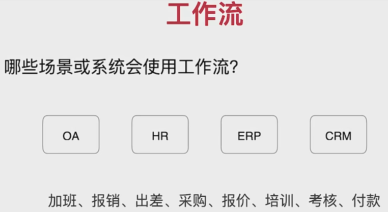
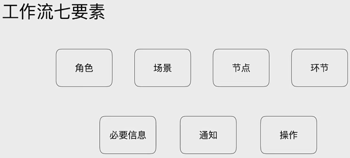
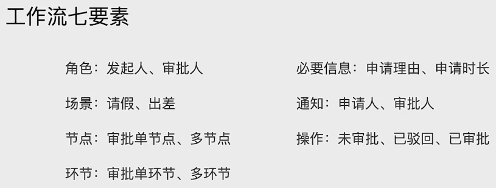
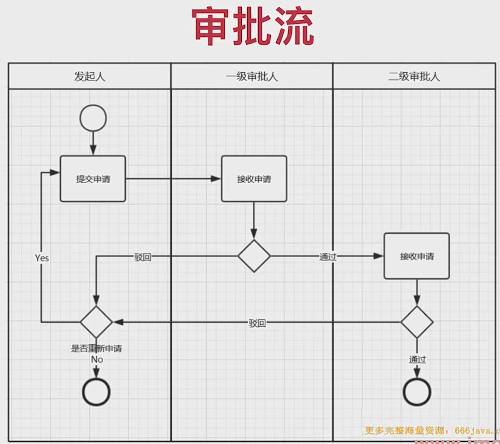
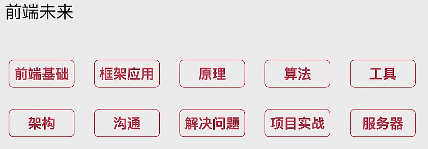

## **Vue3+ElementPlus+Koa2 全栈开发后台系统\**

## 一、**项目概述**

https://blog.51cto.com/u_15703678/5438806

开发服务器 (`dev` 命令) 运行在 `development` (开发) 模式

而 `build` 命令则运行在 `production` (生产) 模式。


- **通过vite创建项目**

> 官方文档：https://cn.vitejs.dev/

创建项目：

```bash
npm init @vitejs/app
# or
cnpm init @vitejs/app
# or
yarn create @vitejs/app manager-fe
```


- **安装项目所需插件**

```bash
# 安装项目生产依赖
yarn add vue-router@next vuex@next element-plus axios -S

# 安装项目开发依赖
yarn add sass -D
```


> element-plus文档：https://element-plus.org/#/zh-CN/component/quickstart

**VSCode安装插件**

```
Eslint
Vetur
TypeScript
Prettie
```

**制定目录结构**

```
manager-fe;
dist;
node_modules;
public;
src;
    api;
    assets;
    components;
    config;
    router;
    store;
    utils;
    views;
App.vue;
main.js
.gitignore
.env.dev
.env.test
.env.prod;
index.html;
```


## 二、**项目依赖**

项目初始化,vite创建项目,插件安装,目录结构,环境配置

https://blog.51cto.com/u_15082391/4517419、

1.-D会被记录到devDependencies【开发环境】  等于 npm中--save-dev

2.-S 会被记录到dependencies【生产环境】   等于npm中--save

 

element-plus官网  学习手册

https://element-plus.org/zh-CN/guide/quickstart.html

 

开发依赖包和生产依赖包安装反了怎么办？

删除yarn.lock,node_modules文件,直接在package.json中调换依赖包的位置 再执行 yarn命令（yarn install）

Yarn.lock作用：锁定版本，安装时会根据yarn.lock中指定的版本安装。

## 三、**项目配置**

1. Vite配置（[开发服务器选项](https://cn.vitejs.dev/config/server-options.html)）

```js
// https://vitejs.dev/config/
export default defineConfig({
  server: {
    host: 'localhost',
    port: 8080
  },
  plugins: [vue()],
})
```

- vite可配置别名，解决./…/问题，类似于Vue里面的@

```js
resolve: { alias:{
'@': path.resolve(   dirname, './src' )
}
```

- 全局的mixin 样式问题，可以通过vite进行配置

```js
css: {
    preprocessorOptions: { 
        scss: {
              additionalData: `@import '@/assets/style/base.scss';`
        }
    }
}
```


2. [环境变量](https://cn.vitejs.dev/guide/env-and-mode.html)：process.env  --> import.meta.env

 

3. .env 文件:

> package.json设置"dev": "vite --mode dev"，才能获取.env文件中的变量

为了防止意外地将一些环境变量泄漏到客户端，只有以 **VITE_** 为前缀的变量才会暴露给经过 vite 处理的代码。

4. package.json说明

   ```json
   * 真实的package.json没有注释（json文件不存在注释）
   {
     "name": "package",//项目名称
     "version": "1.0.0",//项目版本
     "description": "",//项目描述
     "main": "index.js",//主文件（比如默认是index.js，项目名称叫package。那么require(‘package’)将返回index.js返回的内容）
     "scripts": {//指定了运行脚本命令的npm命令行缩写，比如start指定了运行npm run start时，所要执行的命令。
       "test": "echo \"Error: no test specified\" && exit 1"
     },
     "author": "",//作者
     "license": "ISC",//协议
     "devDependencies": {},//devDependencies指定项目开发所需要的模块。
     "dependencies": {},//dependencies字段指定了项目运行所依赖的模块
   }
   ```

5. 引入插件 elementplus
   完整引入`app.use(ElementPlus)`
   [Element Plus官方文档](https://element-plus.org/zh-CN/guide/quickstart.html)

## 四、**路由封装**

### 基本设置

- **配置main.js**

引入router对象 `	import router from './router'`
注册   ``app.use(router)``

-   **HTML使用路由**

​	`<router-view></router-view>`

- **创建路由对象并配置路由**

引入vue-router以及相关的路由组件
`import { createRouter, createWebHashHistory } from 'vue-router';`

在/src/router/index.js中创建 Router对象并暴露


### 配置路由

1. 路由模式 ： [hash和history区别](https://www.bilibili.com/video/BV1GB4y1R7r6/)

2. 创建路由规则数组routes，它定义了路由组件的父子关系

3. 使用`router-view`加载路由组件

4. [路由跳转三种方式](https://juejin.cn/post/7108176713351168037)：

   ```js
   // 1.router-link
   <router-link to="/login">去登录</router-link>
   ```

   ```js
   // 2. Options API传统跳转
   <template>
   	<el-button @click="goHome">回首页</el-button>
   </template>
   
   <script>
   export default{
       name:'login',
       methods:{
           goHome(){
           this.$router.push('/welcome')
           }
       }
   }
   </script>
   ```

   

   ```js
   // 3. Composition API跳转
   <script setup>
   import { useRouter } from 'vue-router'
   let router = useRouter()
   const goHome = ()=>{
       router.push('/welcome')
   }
   </script>
   ```

   

## 五、环境配置封装

```js
const env = import.meta.env.MODE || 'prod';
//尽量把配置封装 根据env选择不同配置
const EnvConfig = {
    dev: {
        baseApi: '/',
        mockApi: 'https://www.fastmock.site/mock/xxx/api'
    },
    test: {
        baseApi: '//test.future.com/api',
        mockApi: 'https://www.fastmock.site/mock/xxx/api'
    },
    prod: {
        baseApi: '/future.com/api',
        mockApi: 'https://www.fastmock.site/mock/xxx/api'
    }
};
export default {
    env,
    mock: true,
    ...EnvConfig[env]
};
```


### axios二次封装

axios是基于 promise的网络请求库

使用axios.create()创建axios实例对象。axios.create()是添加了自定义配置的新的axios。

### post get

post请求方法,`data` 是作为post请求体被发送的数据

get请求方法，`params` 是与get请求一起发送的 URL 参数

### Storage二次封装

key设置为命名空间，value设置为{key:value}bv 

## 六、首页布局开发

默认样式style中设置 **box-sizing:border-box**

```scss
.basic-layout {
  position: relative; //给父元素设置相对定位  相对定位，相对元素自身定位

  .nav-side {//侧边栏
    position: fixed; //子元素设置绝对定位/固定定位(相对父元素定位)，因此通常会给父元素设置相对定位
    width: 200px;
    height: 100vh; //vh: 相对于视窗的高度, 视窗被均分为100单位的vh; 
    background-color: #001529;
    color: #fff;
    overflow-y: auto; // 如果内容溢出，则浏览器自动提供 纵向滚动条。
    transition: width .5s; // 左侧菜单栏宽度变化时的过渡效果

```

```scss
//头部导航栏

 .nav-top {
      height: 50px;
      line-height: 50px; //line-height=height 内容垂直居中
      display: flex;
      justify-content: space-between; //左右布局
      border-bottom: 1px solid #ddd;
      padding: 0 20px;
 }
```

```js
// 配置路由规则数组routes
const routes = [
    {
        name: 'home',
        path: '/',
        meta: {
            title: '首页'
        },
        component: Home,
        redirect: '/welcome',
        children: [
            {
                name: 'Welcome',
                path: '/welcome',
                meta: {
                    title: '欢迎页'
                },
                component: () => import('../views/Welcome.vue'),

            }
     }
]
```

```html
// 以上路由配置在 html中使用  注意必须为父子关系
//App是Home的父组件
<APP>
	<router-view></router-view>
</APP>
```


## 七、登录布局开发

```scss
//flex布局  使得登录元素 处于垂直水平居中

.login-wrapper {
  display: flex;
  justify-content: center;
  align-items: center;
  width: 100vw;
  height: 100vh;
}
```

```scss
//box-radius 设置边框弧度  box-shadow 设置边框阴影

.modal {
    width: 500px;
    padding: 50px;
    background-color: #fff;
    border-radius: 4px;
    /* box-shadow:: x 偏移量 | y 偏移量 | 阴影模糊半径 | 阴影扩散半径 | 阴影颜色 */
    box-shadow: 0 0 10px 3px #c7c9cb4d;
```


## 八、登录交互开发

1. 使用`element-plus`中`<el-form>`组件
2. 给按钮添加点击事件，执行回调函数login()
3. `<el-form>`提供validate()  对整个表单的内容进行验证。
4. 发起axios请求
5. 请求成功，将获取的数据保持提交到store (vuex管理数据)，保存至storage中
6. 跳转路由至'/welcom'

## 九、欢迎页面布局开发

```scss
//要使content-wrapper 和 img-wrapper都是水平和垂直方向均居中 => flex 布局

.welcome-wrapper {
  display: flex;
  justify-content: center;
  align-items: center;
    
    .content-wrapper {
    position: relative;
    bottom: 60px;
        
  .img-wrapper {
    margin-left: 105px;
  }
}
```

## 十、首页交互开发

### 面包屑组件封装

- nav-top左侧     fold图标、面包屑
  面包屑 `<BreadCrumb>`封装

  ```vue
  <script >
  export default {
      name: 'BreadCrumb',
  
      computed: {
          routeList() {
              return this.$route.matched;
          }
      }
  };
  </script>
  
  <template>
      <el-breadcrumb separator-icon="ArrowRight">
          <el-breadcrumb-item v-for="route in routeList" :key="route.path">
              <router-link :to="route.path">
                  {{ route.meta.title }}
              </router-link>
          </el-breadcrumb-item>
      </el-breadcrumb>
  </template>
  ```

- nav-top右侧     badge组件、userInfo、下拉框dropDown

  获取notice的值（待审批数量）、获取userInfo

  > 发起axios请求，拿到noticeCount和userInfo的数据

  下拉框dropDown

  ```scss
  // 解决elment-plus中 下拉框dropDown 出现黑边框的问题
  
  .dropdown-link {
              // line-height: 4;
              color: #409eff;
              cursor: pointer;
  
              // &连体符 表示元素本身
              &:hover,
              &:active,
              &:focus {
                outline: none;
              }
            }
  ```

  `<el-badge>`标记组件内部元素 垂直居中问题   指定元素的内容高度 `line-height`

  ```scss
      .notice {
        /* height设置元素自身的高度，line-height设置子元素的高度 */
        line-height: 30px; //line-height指定匿名行内框的最小高度
        margin-right: 15px;
        ;
      }
  ```

  

### 动态获取菜单组件封装

- 点击`nav-top`中的`Fold 图标`收起/展开侧边栏

  ```scss
  //scss中的语法：&连体符 表示元素本身 
  
  .nav-side {
   	// &指 .nav-side
      &.fold {
        width: 64px;
      }
  
      &.unfold {
        width: 200px;
      }
    }
  ```

- 动态获取样式

  ```html
  <div :class="['nav-side', isCollapse ? 'fold' : 'unfold']">
  ```

  

- 动态获取菜单，`<TreeMenu>`封装

```vue
<script >
export default {
    name: 'TreeMenu',
    props: ['userMenu'],
};
</script>

<template>
    <div>
        <!-- 在template标签上使用v-for，:key="index"不能写在template标签上，因为其标签不会被渲染，会引起循环错误 -->
        <template v-for="menu in userMenu">
            <el-sub-menu v-if="menu.children && menu.children.length > 0 && menu.children[0].menuType == 1" :key="menu.id"
                :index="menu.path">
                <template #title>
                    <el-icon v-if="menu.icon">
                        <component :is="menu.icon"></component>
                    </el-icon>
                    <span>{{ menu.menuName }}</span>
                </template>
                <TreeMenu :userMenu="menu.children" />
            </el-sub-menu>
            <el-menu-item v-else-if="menu.menuType == 1" :index="menu.path" :key="menu._id">
                {{ menu.menuName }}
            </el-menu-item>
        </template>
    </div>
</template>
```

### 登录退出业务逻辑

1. 设置store中存储的userInfo为空
2. 路由跳转至登录页面
3. 清空Local storage中userInfo的信息

### 获取菜单路由

```js
activeMenu() {
      return location.hash.slice(1);
}
```

```html
<el-menu :default-active="activeMenu" class="menu-content" background-color="#001529" text-color="#fff" router :collapse="isCollapse">
    <TreeMenu :userMenu="userMenu" />
</el-menu>
<!-- default-active ：index of active menu on page load -->
```


## 十一、JWT实现token验证

1. 解决token为空，axios请求拦截问题  
   `const { token = "" } = storage.getItem('userInfo') || {};`

```js
service.interceptors.request.use((req) => {
    // 在发送请求之前添加认证头
    const headers = req.headers;
    if (!headers.Authorization) {
        const { token = "" } = storage.getItem('userInfo') || {};
        headers.Authorization = "Bearer " + token;
    };
    return req;
}
```

```js
//vite.config.js 开启代理，访问服务器的数据

server: {
    host: 'localhost',
    port: 8080
    port: 8080,
    proxy: {
      "/api": {
        target: "http://localhost:3000",
      }
    }
  }
```

```js
mock:false // 关闭mock接口
```

## 十二、用户管理页面布局与交互开发

### 背景知识

用户注册: 密码基于md5摘要算法实现。也可基于其它算法(RSA或AES)再前端进行加密传输.

安全性保障措施:
1.使用https协议，添加数字证书，确保信息安全
2.使用加密算法，对重要信息进行加密处理.

- ​	对称加客: DES、AES、RC5、RC6
- ​	非对称加客: RSA、DSA
- ​	摘要算法: md5(简单密码容易暴力破解)

完善用户登录功能
1.登录和注册功能，对于加密信息保持一致

核心知识点
1.交互风格统一(条件查询、列表数据、操作按钮、新增弹框、分页)
2.开发流程清晰(静态布局、动态交互、数据Mock、接口联调、功能完善)
3.日期格式化插件开发

### form

**el-form**表单：el-form 的 **`:model`** 属性指定是表单数据对象

```html
<el-form :model="groupData" :rules="rules" ref="groupForm">
	<el-form-item label="分组名称：" prop="name">
	  <el-input v-model="groupData.name"/>
	</el-form-item>
</el-form>

```

**el-form**表单：**`ref` 属性 获取 Dom 元素的 (el-form表单对象)**

```html
<el-form :model="groupData" :rules="rules" ref="groupForm">
</el-form>
```

```js
//VUE3
setup(){
    const groupForm = ref()
    return{
        groupForm
    }
}

//VUE2    ref 绑定控件，$refs 获取控件。
this.$refs[groupForm]
```

**el-form**表单 resetForm / submitForm中参数为`ref`的值，因此**必须定义ref="ruleFormRef"** 

```js
<el-form ref="ruleFormRef" :model="ruleForm" :rules="rules" label-width="120px">
    <el-form-item>
  		<el-button type="primary" @click="submitForm(ruleFormRef)">Create
 	 	</el-button>
 		<el-button @click="resetForm(ruleFormRef)">Reset</el-button>
	</el-form-item>
</el-form>

const ruleFormRef = ref()
const submitForm = async (formEl) => {
  if (!formEl) return
  await formEl.validate((valid, fields) => {
    if (valid) {
      console.log('submit!')
    } else {
      console.log('error submit!', fields)
    }
  })
}

const resetForm = (formEl) => {
  if (!formEl) return
  formEl.resetFields()
}
```

**el-from-item** 的 **`prop`** 属性必须与 el-input 中需要校验的表单属性`v-model`一致。

```html
<el-form ref="dialogForm" :model="createdMenu" label-width="100px" :rules="rules">
    <el-form-item label="菜单名称" prop="menuName">
      <el-input v-model="createdMenu.menuName" placeholder="请输入菜单名称" />
    </el-form-item>
    <el-form-item label="菜单图标" prop="icon" v-show="createdMenu.menuType == 1">
      <el-input v-model="createdMenu.icon" placeholder="请输入菜单图标" />
    </el-form-item>
</el-form>
```

 **el-form** 的 `:model="auditForm"` 需要和 `v-for="(item, index) in auditForm`" 保持一致 

```html
<el-form ref="auditFormRef" :model="auditForm" label-width="120px" label-suffix=":" :rules="rules">
	<el-form-item v-for="{ prop, label } in auditForm" :key="prop" :label="label" :prop="`${prop}`">
      <el-input type="textarea" :rows="3" placeholder="请输入审核备注" v-model="auditColums[`${prop}`]" />
	</el-form-item>
</el-form>
```

> vue3 官方案例 https://element-plus.org/en-US/component/form.html#add-delete-form-item

```html
<el-form :model="dynamicValidateForm" ref="dynamicValidate" label-width="100px" >
    <el-form-item v-for="(domain, index) in dynamicValidateForm.domains" :label="'域名' + index" :key="domain.key"
      :prop="'domains.' + index + '.value'" :rules="{
        required: true, message: '域名不能为空', trigger: 'blur'
      }">
      <el-input v-model="domain.value"></el-input>
    </el-form-item>
    <el-form-item>
      <el-button type="primary" @click="submitForm('dynamicValidate')">提交</el-button>
    </el-form-item>
</el-form>
```


### slot

我们经常使用`template`中的**作用域插槽**，作用是在外部获取组件内的数据 ,这里是为了获取这一行的数据，我们让`slot-scope`值为`scope`，那么由`scope.row`就可以得到数据。

**slot-scope插槽的写法：**

- 旧版写法

```html
<el-table-column label="问题状态" align="center" prop="status">
   <template slot-scope="scope">
    <span>{{scope.row.status==0?'待整改':(scope.row.status==1?'已整改':'已关闭')}}</span>
  </template> 
</el-table-column>
```

- 新版写法

```html
 <el-table-column label="问题状态" align="center" prop="status">
  <template #default="{row}">
    <span>{{row.status==0?"待整改":(row.status==1?"已整改":"已关闭")}}</span>
  </template>
</el-table-column>

 <el-table-column label="问题状态" align="center" prop="status">
  <template #default="scope">
    <span>{{scope.row}}</span>
  </template>
</el-table-column>
```

element-plus 插槽的几种类型：

```
default	自定义输入建议的内容。 自定义标签，参数为
prefix	输入框头部内容
suffix	输入框尾部内容
prepend	输入框前置内容，在 prefix 之前
append	输入框后置内容，在 suffix 之后
```

el-input中放插槽，把自闭合标签修改为 闭合标签

```html
<el-input v-model="createdUser.userEmail" placeholder="请输入用户邮箱">
	<template #append>imooc.com </template>		
</el-input>
```


### table

**elementUI table 获取已勾选的行的数据:**

- 使用 selection-change事件函数

```js
// elementUI table 获取已勾选的行的数据
const handleSelectionChange = (val) => {
  const arr = val.map(item => item.userId);
  checkedUserIds.value = arr;
};

 <el-table ref="tableRef" :data="userList" stripe style="width: 100%" type='selection' @selection-change="handleSelectionChange">
```

- formatter 格式化数据

```js
const userColums = reactive([
  { prop: 'userId', label: '用户ID' },
  { prop: 'userName', label: '用户名' },
  { prop: 'role', label: '用户角色',
    formatter(row, column, value) { 
        return { 1: '普通用户', 0: '系统管理员' }[value]}
  },
  { prop: 'state', label: '用户状态',
    formatter(row, column, value) { 
        return { 1: '在职', 2: '离职', 3: '试用期' }[value]}
  }
]);

<el-table-column v-for="{ prop, label, formatter } in userColums" :key="prop" :prop="prop" :label="label" :formatter="formatter" />
```

### select

 `v-model` 属性的值 是当前被选中的 `el-option` 的 value 属性值

```html
<el-select v-model="value" class="m-2" placeholder="Select" size="large">
    <el-option
      v-for="item in options"
      :key="item.value"
      :label="item.label"
      :value="item.value"
    />
  </el-select>
```

### 编辑单行与新增的逻辑

`nextTick` ：编辑按钮回调 将row的数据赋值给 表单数据，经过渲染后createdUser的初始值即为row的值，此时，新增操作的表单的resetForm就会将数据重置到row值。
	nextTick 将赋值推辞到下一dom更新之后再执行，则createUser依旧为初始定义值。

```js
//编辑某一行数据
const handleEdit = (row) => {
      console.log(row);
      action.value = 'edit';
      dialogVisible.value = true;
      //  nextTick 是将回调推迟到下一个 DOM 更新周期之后执行。在更改了一些数据以等待 DOM 更新后立即使用它;
      nextTick(() => {
        Object.assign(createdUser, row);
      });
};


//新增操作回调
const handleCreate = () => {
      action.value = 'add';
      dialogVisible.value = true;
    };
// 重置表单
const resetForm = (formEl) => {
      formEl.resetFields();
      dialogVisible.value = false;
};
```


## 十三、菜单管理页面布局与交互开发

### 功能清单

1菜单列表
2菜单创建
3.菜单编辑
4菜单删除
5.菜单名称递归展示

### 清空表单resetFields

报错：TypeError: Cannot read property ‘resetFields‘ of undefined解决方案

解决方法：

- 1. 使用 $nextTick，保证 dom 已经渲染成功

```js
resetForm(formName) {
    this.$nextTick(()=>{
        this.$refs[formName].resetFields();
    })                
}
//this.$nextTick 将回调延迟到下次DOM更新循环之后执行。

//上述报错原因就是因为dom元素没有渲染完成就执行了方法，导致找不到报错；执行此方法即解决这个问题；
```

> **注意事项**：对DOM一系列的js操作最好都要放进Vue.nextTick()的回调函数中

- 2. 如果是第一次点击没必要重置，判断一下undefined即可

```js
resetForm(formName){
    if (this.$refs[formName]!==undefined) {
       this.$refs[formName].resetFields();
    }
}
//备注：关于此类报错可能第一次打开报错（对象没生成导致报错），后续就不再报错了，如果一直报错就尝试  方法1
```


## 十四、角色管理布局与交互

### 功能清单:

1.角色列表
2.角色创建
3.角色编辑
4.角色删除
5.菜单权限设置
6.角色权限列表递归展示

### RBAC模型:

Role-Base-Access-Control
用户分配角色 -> 角色分配权限 -> 权限对应菜单、按钮
用户登录以后，根据对应角色，拉取用户的所有权限列表，对菜单、按钮进行动态渲染。

### 模块封装

**加强自身对通用模块封装能力、提高开发效率，不断积累架构思维，提高自身核心竞争力。**

### 背景知识

```js
1. 设计思路：
RABC模式。一个用户对应多个角色；一个角色对应多个权限

2. menuType： 1 表示菜单，2 表示按钮

3. 后端设置 一级、二级、按钮的分类：
	3.1 一级 parentId = [null];有children；无action
	3.2 二级 有children；有action
	3.3 按钮 无children；menuType=2
```

### 权限设置checked业务逻辑：

我们规定：`checkedKeys` 保留按钮级别的权限；`halfCheckedKeys` 用于一级二级菜单状态。（服务器主要接收 按钮的id）

而element-plus提供的属性 `checkedKeys` 与 `halfCheckedKeys`是元素的真实选中状态。

因此，需要从element-plus提供的 `checkedKeys`属性中挑出来**菜单**。

```js
// 更新权限设置
async submitPermissionForm() {
  const nodes = this.$refs['treeRef'].getCheckedNodes();//全选的节点信息
  console.log('nodes=>', nodes);
  const halfKeys = this.$refs['treeRef'].getHalfCheckedKeys();
  const parentKeys = [];
  const checkedKeys = [];
  nodes.map((node) => {
    if (!node.children) {//说明是按钮
      checkedKeys.push(node._id);
    } else {//说明是菜单
      parentKeys.push(node._id);
    }
  });
  const params = {
    _id: this.curRoleId,
    permissionList: {
      checkedKeys,
      halfCheckedKeys: parentKeys.concat(halfKeys)
    }
  };
  await this.$api.updatePermission(params);
}
}
```


### formatter引用data解决方法

```js
roleColums: [
        {
          prop: 'permissionList', label: '权限列表', formatter(row, column, value) {
            const arr = [];
            const list = value.halfCheckedKeys || [];
            list.map((item) => {
              if (item) arr.push(this.actionMap[item]);
                //此时this指向表单的作用域
            });
            return arr.join(",");
          }
        }
      ]

// 修改如下：

formatter: (row, column, value)=> {
            const arr = [];
            const list = value.halfCheckedKeys || [];
            list.map((item) => {
              if (item) arr.push(this.actionMap[item]);
                //此时this指向vue实例对象
            });
            return arr.join(",");
          }
        }
```

- 递归遍历获取{_id: menuName}字典

```js
// 递归遍历获取 菜单id与菜单名称对应值
getActionMap() {
  const actionMap = {};
  const deep = (list) => {
    while (list.length) {
      const item = list.pop();
      if (item.children && item.action) {//有按钮的二级菜单
        actionMap[item._id] = item.menuName;
      } else if (item.children && !item.action) {//有二级菜单的一级菜单
        deep(item.children);
      }
    }
  };
  deep(JSON.parse(JSON.stringify(this.menuList)));
  this.actionMap = actionMap;
}
```

### 项目中遇到的方法

#### 防 报错方法

```js
//后续会遍历数组，数组必须给默认空数组
const list = value.halfCheckedKeys || []; 

//后续会访问对象的属性，对象必须给默认空对象
const userInfo = storage.getItem('userInfo') || {}

// 返回一个数组，其中只包括通过回调函数语句 /True 的元素。 
arr.filter((item) => item);//{return item} item为True 就加入返回的新数组
        
//深拷贝 对象第一层数据
Object.assign(this.createdMenu, value)
```

#### 深拷贝方法

```js
JSON.parse(JSON.stringify(this.menuList))
```

## 十五、工作流










> 流程图由processon绘制

### 自定义指令

理解指令：v-has

- v-on:click = "handleUser"
- click 对应binding.arg ，表示指令参数
- handleUser 对应binding.value ，表示指令值

```js
app.directive('has', {
    beforeMount: (el, binding) => {
        console.log(el, binding);
        el.style = 'display:none';//设置display:none之后依然可以在浏览器页面勾选style
        // 直接删除该节点
        el.parentNode.removeChild(el);//报错 TypeError: Cannot read properties of null (reading 'removeChild')
    }
});

//修改如下
app.directive('has', {
    beforeMount: (el, binding) => {
        console.log(el, binding);
        el.style = 'display:none';//设置display:none之后依然可以在浏览器页面勾选style
        // 直接删除该节点
        setTimeout(()=>{
            //beforeMount钩子未挂载dom,此时拿不到dom元素.将dom操作加入宏任务队列(macro-task).
        	el.parentNode.removeChild(el);
        })
    }
});
//执行顺序:从script(整体代码)开始第一次循环。之后全局上下文进入函数调用栈。直到调用栈清空(只剩全局)，然后执行所有的micro-task。当所有可执行的micro-task执行完毕之后。循环再次从macro-task开始，找到其中一个任务队列执行完毕，然后再执行所有的micro-task，这样一直循环下去。

//在这个例子中,script与setTimeout均为macro-task.因此,执行完所有同步代码,再执行setTimeout任务队列的代码
```

### 导航守卫

常用API：`beforeEach()、afterEach()、getRoutes()、push()、back()、addRoute()`
判断当前路由是否存在时，也可以使用`hasRoute()`
原代码： `router.getRoutes().filter(route => route.path == path).length;`  => `router.hasRoute(to.name)`

1. 标签页标题更改  `document.title = to.meta.title`
2. 访问页面不存在时拦截/权限拦截

```js
/**
用户菜单权限：
用户登录->获取用户身份（管理员or普通用户）->调用 权限列表 接口->递归生成菜单和按钮列表->前端进行菜单渲染
**/
router.getRoutes().filter((item) => item.path == path)
```

### 路由懒加载/按需加载

```js
/**vite动态加载路由时,注意component的地址:
1.url必须提取出来
2.地址需要添加.vue后缀
3.不可以使用 @/views
**/
component：()=>import('@/views/*.vue')
```

[原理](https://juejin.cn/post/7119647017009152013)

### 项目中遇到的问题

1. 进入路由守卫时，不断循环

   在路由守卫中，只有`next()`是放行，其他的诸如：`next('/login') 、 next(to) 或者 next({ ...to, replace: true })`都不是放行，而是：**中断当前导航，执行新的导航**

   ```js
   //在守卫中我使用next('/login')
   //错误理解：直接跳转到/login路由：
   beforeEach((to, from, next) => {
     next('/login')
   }
              
   //实际上：next('/login')不是直接去/login，而是中断这一次路由守卫的操作，又进入一次路由守卫，就像嵌套一样，一层路由守卫，然后又是一层路由守卫，此时路由守卫进入到第二层时，to.path已经不是/home了，这个时候才执行next()放行操作。 如果守卫中没有正确的放行出口的话，会一直next({ ...to})进入死循环 !!!
   beforeEach((to, from, next) => {
     beforeEach(('/login', from, next) => {
     	 beforeEach(('/login', from, next) => {
     	 	 beforeEach(('/login', from, next) => {
     	 	 	beforeEac...  // 一直循环下去...... , 因为我们没有使用 next() 放行
    		}
    	 }
     }
   }
   ```

   

2. 动态路由刷新后丢失

   分析：路由前置钩子，每次访问路由都会执行。但是，`loadAsyncRoutes()`函数仅执行一次。

   方案：`loadAsyncRoutes()`在路由前置钩子中执行，将动态路由保存至vuex或storage

3. 

```js
// 创建路由对象
const router = createRouter({
    history: createWebHashHistory(),
    routes
});

//加载动态路由
loadAsyncRoutes();

// 导航守卫
router.beforeEach((to, from, next) => {
    if (router.hasRoute(to.path)) { //to.path 要访问的路由组件路径path
        document.title = to.meta.title;// 标签页标题更改
        next();
    } else {
        next('/404');
    }
});

async function loadAsyncRoutes() {
    const userInfo = storage.getItem('userInfo') || {};
    if (userInfo.token) {
        //不直接从Local storage中取menu，防止数据人为篡改
        const { treeList } = await api.getPermissionList();
        // console.log(treeList);
        const routes = getRouteMap(treeList);
        routes.map((item) => {
            let url = `./../views/${item.component}.vue`;
            console.log(url);
            item.component = () => import(url);
            router.addRoute('home', item);//作为home组件的children
        });

    };
}
```

- 分析：

  `loadAsyncRoutes()`中执行 `await api.getPermissionList();`时会将该任务放入异步队列；然后执行导航守卫，此时`router.getRoutes()`尚未获取到动态路由，会直接进入404页面。最后进入promise队列，获取动态路由。此时，完成一次事件循环。

  

## 十六、休假申请布局与交互

### 项目中遇到的问题

1. userSchema中定义字段以及类型规定：前端创建数据字段或类型与其不匹配，则无法正确创建数据。
   如：`component：String`=>`componet：String`
2. 使用一个函数需要获取不同值，可以使用 回调函数

```html
<el-form-item label="休假时间" required>
  <el-row>
    <el-col :span="10">
      <el-form-item prop="startTime">
        <el-date-picker type="date" v-model="createdApply.startTime" placeholder="请选择开始日期"
          @change="() => handleDateChange('startTime', val)" />
      </el-form-item>
    </el-col>
    <el-col :span="1">-</el-col>
    <el-col :span="10">
      <el-form-item prop="endTime">
        <el-date-picker type="date" v-model="createdApply.endTime" placeholder="请选择结束日期"
          @change="() => handleDateChange('endTime', val)" />
      </el-form-item>
    </el-col>
  </el-row>
</el-form-item>
```

3. 三目运算 

   实现value<=2，等于自身；>2则等于3
   `stepNo.value = row.applyState > 2 ? 3 : row.applyState;`

## 十七、待审核布局与交互

- 审核人员-待审批列表：

```js
//1. 我是第一审核人
params ={ curAuditUserName: data. userName, applystate: 1 }

//2. 我是第二或第三审核人
params ={ curAuditUserName: data. userName, applystate: 2 }

//所以，完整的查询条件如下：
params = { curAuditUserName: data. userName, $or: [{ applystate: 1 applystate: 2}]}
```

- 审核人员-审批通过/审批拒绝/作废列表：

```js
//审批流里面需要包含我，注意这是一个子文档查询
params = {auditFlows.userId: data.userId }
```

- 审核接口- /同意

```js
const doc = await Apply.findById(_id);
const auditLogs = doc.auditLogs || [];
//规定三级审核通过（根据auditLogs的长度判断）
// 审核通过 -- 1:待审批 2:审批中 3:审批拒绝 4:审批通过 5:作废
if (auditLogs.length == doc.auditFlows.length) {//三级审核完毕
    ctx.body = util.success('', '当前申请单以及处理，请勿重复提交');
    return;
    //最后一级审核（优先判断，否则会进入一/二级审核）
} else if (auditLogs.length + 1 == doc.auditFlows.length) {
	params.applyState = 4;	
    //第一级/第二级审核
} else if (auditLogs.length < doc.auditFlows.length) {
	params.applyState = 2;
	params.curAuditUserName = doc.auditUsers.split(',')[auditLogs.length + 1];
}

auditLogs.push({  //添加新的审核记录
  userId: data.userId,
  userName: data.userName,
  createTime: Date.now(),
  remark,
  action
});
params.auditLogs = auditLogs;
const res = await Apply.findByIdAndUpdate(_id, params);
```

## 十八、造轮子

周会和例会作用：

1. 第一个是发现大家遇到了一些问题是什么？我们可以通过力量去帮他们去解决
2. 第二是我们可以知道每个同学呢，他们的完成度对一些自身工作的一个完成度，比如说我们本周你需要完成哪些需求？你到底有没有完成？你完成了多少？完成过程中有没有遇到什么问题？

有能力：

1. Review Code - 代码质量过硬 
   leader review 组员  （语法简洁、没有基本的语法错误、运行效率高、逻辑缜密）
   一年组员 review 五年 -->学习过程
   五年 review 一年 -->发现漏洞和问题
2. 工作汇报- 业绩好
   通过工作汇报，会知道哪些组员做得更好一些，也可以反映出来比较优秀的组员。
3. 解决问题-能力高
4. 技术话题深度沟通-潜力

造轮子：

重新实现现有的功能，以达到更高的效率



### 创建脚手架


### 创建query-form
